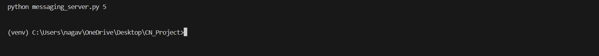

# CSCE 5580 Section 002 - Computer Networks (Fall 2024 1)
##### GitHub Link: https://github.com/ynvp/computer_networks_project
## Group 8
1. Naga Vara Pradeep Yendluri
2. Venkata Varuna Sri Budidi
3. Jyothi Anjan Manini
4. Pradyumna Dyaga

## Installation instructions
1. Install virtualenv module to install all dependencies.
2. Use ``` pip install virtualenv ```
3. On windows create virtual environment using ``` virtualenv venv ```
4. Activate venv using ``` venv\Scripts\activate ```
5. Install dependencies using ``` pip install -r requirements.txt ```
6. Whenever opening a new terminal activate environment first before starting server.

## Starting server and spawning nodes
1. ``` python messaging_server.py <no_of_nodes> ``` example: ``` python messaging_server.py 2 ``` starts server and spawns 2 nodes.
2. All connected nodes are shown in server UI.
3. When a node is disconnected, server gracefully disconnects from node and closes socket associated with it.
4. When server shutdown button is clicked, it triggers all nodes to gracefully disconnect themselves from the socket and close the connections.
5. Connecting a node manually to server ``` python node.py <node_name> ``` example: ```python node.py Node4```.
6. Any connection to the server is updated in server UI.

Sever window

Node window

Message
server:

node4:

node:

Client disconnect:

Server view:

server updates current active connections in Address table window.
Other clients view:


Server shutdown:

client view:
